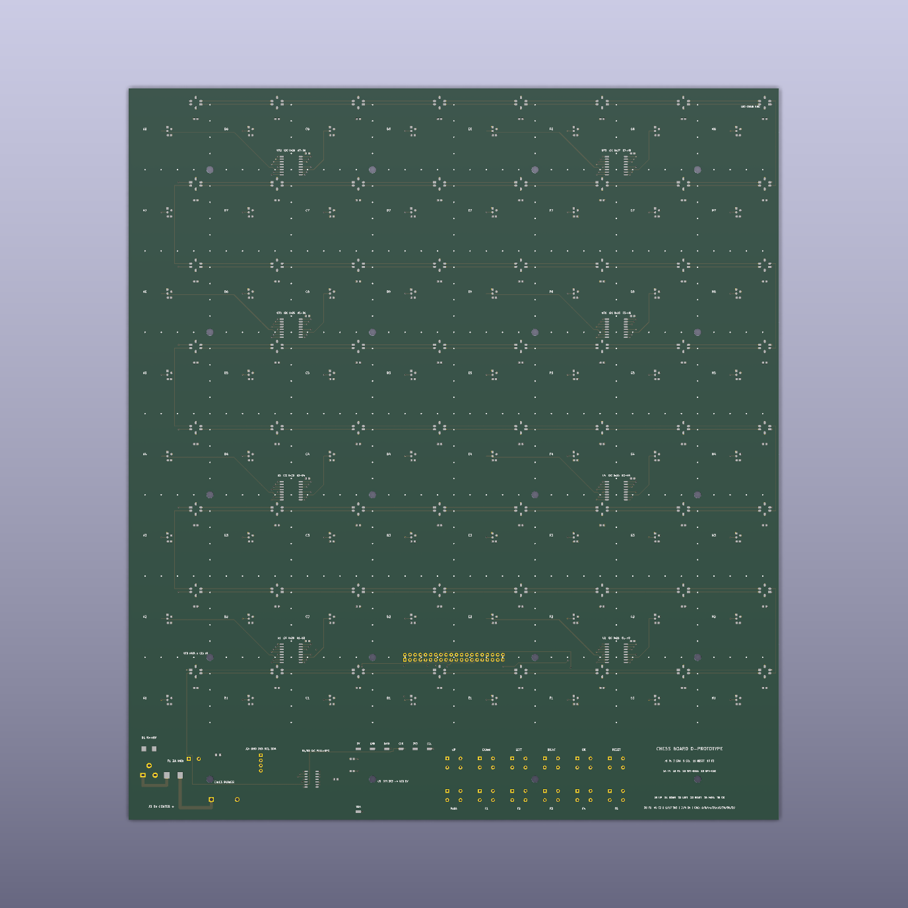
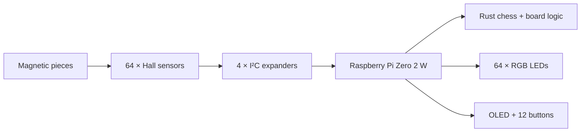

<div align="center">

# Chess ♟️

### A physical chessboard with software in its bones.

**64 magnetic sensors · 64 RGB lights · one Raspberry Pi · zero hidden magic**

[](https://github.com/nicksan222/chess/actions/workflows/ci.yml)
[](https://github.com/nicksan222/chess/actions/workflows/firmware.yml)
[](Cargo.toml)
[](hardware/pcb/)
[](hardware/cad/)
[](LICENSE)

[**Explore the hardware**](hardware/README.md) · [**Read the architecture**](docs/architecture.md) · [**Build from source**](docs/development.md) · [**Contribute**](CONTRIBUTING.md)

<a href="hardware/cad/generated/board-assembly-finished.png">
  
</a>

<sub>Not a product mockup—the render above is generated from the <a href="hardware/cad/generated/board-assembly.blend">Blender assembly model in this repository</a>.</sub>

</div>

## About

Chess is an open-source smart chessboard designed to make the physical game
programmable. The design gives every square its own magnetic piece sensor and
clocked RGB light, ready to illuminate moves, threats, prompts, or entirely new
game modes. A Raspberry Pi Zero 2 W is intended to run the board directly in
Rust—there is no microcontroller, companion firmware, or private protocol in
the middle.

The interesting part is not only the board. Its mechanical dimensions,
electrical connectivity, firmware pin maps, KiCad project, Blender models, BOM,
and review images are generated from version-controlled contracts. Change a
measurement or signal once, regenerate, and let tests catch disagreement across
the stack.

| | |
|---|---|
| **Sense** | 64 omnipolar Hall sensors, one per square |
| **Glow** | 64 individually addressable SK9822 RGB LEDs |
| **Think** | Raspberry Pi Zero 2 W targeting Rust on a Yocto Linux image |
| **Interact** | 12 tactile buttons and a 1.3-inch OLED |
| **Build** | One 320 × 360 mm PCB and two generated printable parts |
| **Design** | Python contracts → KiCad 9 + Blender 4.5 + firmware mappings |

## Peek under the board

<table>
  <tr>
    <td width="58%">
      <a href="hardware/cad/generated/board-assembly-open.png">
        
      </a>
    </td>
    <td width="42%">
      <a href="hardware/pcb/generated/board-top.png">
        
      </a>
    </td>
  </tr>
  <tr>
    <td align="center"><strong>Two printed parts. One PCB. No per-square wiring harness.</strong></td>
    <td align="center"><strong>Every square gets a sensor and an LED.</strong></td>
  </tr>
</table>

The visuals are review artifacts, not hand-drawn diagrams. Open the
[Blender assembly](hardware/cad/generated/board-assembly.blend), inspect the
[KiCad board](hardware/pcb/generated/chess-board.kicad_pcb), browse the
[generated schematic](hardware/pcb/generated/schematic/chess-board.svg), or
check every exact part in the [generated BOM](hardware/pcb/generated/bom.md).

## Why this is fun to hack on

| Hardware you can reason about | Software with clean seams | A workflow built for changes |
|---|---|---|
| No second processor and no opaque wire protocol. The Pi talks to I²C expanders, SPI LEDs, GPIO buttons, and the display directly. | The chess engine, menu model, persistence, simulator, and Pi application live in separate Rust crates. | One devcontainer pins Rust, Ruff, KiCad, Blender, and Just. CI checks code, connectivity, layout, CAD, and the AArch64 firmware graph. |



Read the [architecture notes](docs/architecture.md) for the boundaries and the
[hardware design](docs/hardware.md) for the component choices behind them.

## Repository tour

| Path | What is inside |
|---|---|
| [`apps/firmware`](apps/firmware) | The Raspberry Pi process, system integration, and Yocto image |
| [`apps/simulator`](apps/simulator) | A scaffold for host-side virtual board tooling |
| [`crates`](crates/README.md) | Chess rules, menu state, persistence, logging, and shared Rust code |
| [`hardware/shared`](hardware/shared) | The source of truth for dimensions, parts, wiring, and mappings |
| [`hardware/pcb`](hardware/pcb) | PCB definition, routing, validation, KiCad project, and BOM |
| [`hardware/cad`](hardware/cad) | Parametric enclosure generators, Blender models, and renders |
| [`docs`](docs/README.md) | Architecture, fabrication, power, assembly, and development guides |

## Start hacking

Clone the repository, open it in the included
[development container](.devcontainer/README.md), and then use its pinned
toolchain:

```bash
just --list       # discover everything the repo can do
just precommit    # fast code + hardware validation
just generate     # regenerate CAD and PCB review artifacts
just check        # run routine repository-wide validation
```

Physical-release and Linux-image validation remain explicit, separate gates:

```bash
just pcb-release
just firmware-check
```

Prefer a smaller loop? Every app, crate, and hardware domain owns its own
`justfile`:

```bash
just --justfile crates/chess/justfile check
just --justfile hardware/pcb/justfile review
just --justfile hardware/cad/justfile generate
```

See [`docs/development.md`](docs/development.md) for the full workflow.

## Project status

> [!IMPORTANT]
> **The current design is ready for review, not yet physically proven.** The
> mechanical design and `C-PROTOTYPE` PCB generate successfully, and automated
> ERC, DRC, connectivity, schematic-parity, and firmware checks pass. No
> complete board has been built yet. Prototype one sensor/LED square before
> ordering the full PCB.

The chess model and supervised firmware process exist. Hardware workers,
provisioning workers, and final physical validation are still open territory.
That makes this a particularly good time to challenge assumptions and shape the
project rather than only polish a finished product.

## Pick a quest

- **Firmware:** connect the Rust application to real Linux character devices.
- **Simulator:** make board behavior fast to test without a soldering iron.
- **Electronics:** review sensing, power, routing, and manufacturability.
- **Mechanical:** test clearances, print strategy, materials, and light diffusion.
- **Docs:** turn a pile of generated artifacts into a delightful build journey.

Start with [`CONTRIBUTING.md`](CONTRIBUTING.md), bring large ideas to
[Discussions](https://github.com/nicksan222/chess/discussions), and use the issue
forms for focused bugs or features. First-time contributors are very welcome.

---

<div align="center">

**Build it. Break it. Teach it a new game.**

Released under the [MIT License](LICENSE) · Please follow the
[Code of Conduct](CODE_OF_CONDUCT.md) · Report security issues via
[`SECURITY.md`](SECURITY.md)

</div>
