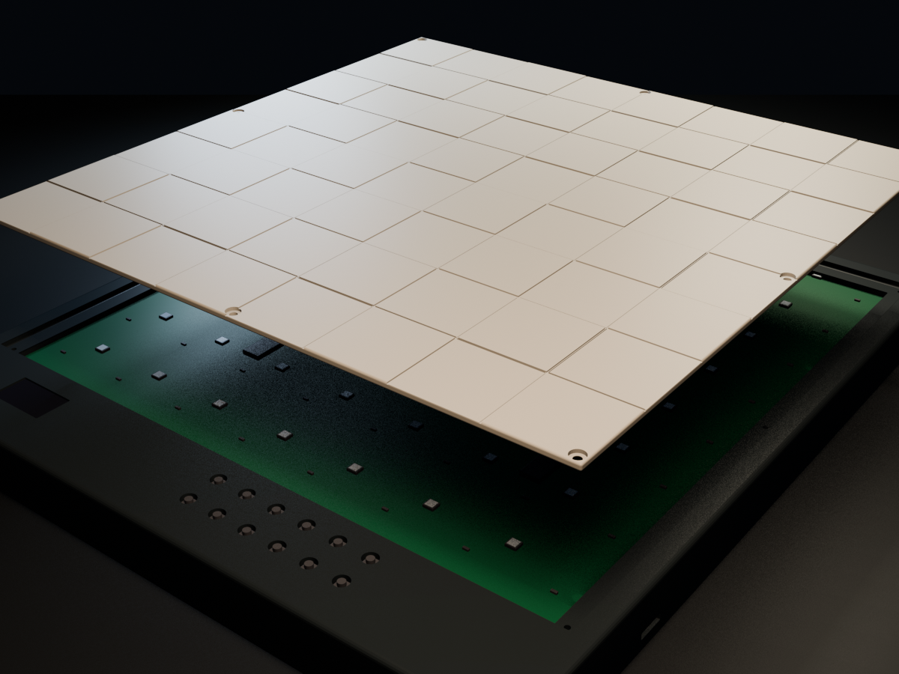

# Chess ♟️

Chess is an open-source smart chessboard you can build, modify, and play on.
Each square senses a magnetic piece and has its own RGB light, allowing the board
to follow a physical game, highlight moves, and provide feedback. A Raspberry Pi
Zero 2 W runs the whole thing in Rust.

  
  
   
  The finished board—and the same board with its plate lifted off. See the <a href="hardware/cad/">Blender CAD sources</a>.

## What makes it buildable

The design is deliberately constrained so that someone who is not an electrical
engineer can review it and assemble it by hand at a kitchen table:

- **One PCB**, 320 x 360 mm, carrying all 64 sensors, all 64 LEDs and the control
  panel. No wiring harness.
- **Common SMD packages** for sensors, expanders, logic, and passives; the Pi,
  display, power inlet, and controls retain practical through-hole connectors.
- **Two printed parts**: a case and a single plate with the checkerboard engraved
  into it. The previous revision needed 129 prints to cover a board.
- **No firmware.** The board has no microcontroller, so there is no second
  toolchain, no cross-compilation target and no flashing step — just one Linux
  binary on the Pi.

That last point is only possible because of two component choices: every Hall
sensor gets its own pin on an I2C expander instead of being scanned as a matrix,
and the LEDs are SK9822, which carry a clock line and so have no timing
requirement a non-real-time host could violate.
[`docs/hardware.md`](docs/hardware.md) explains both.

## Repository

The repository contains the software, the design contract, the board layout and the
printable CAD needed to build the board. Python composes a native KiCad project
from reviewed shared definitions and connectivity. Run `make gen` to regenerate everything, or see
[`docs/development.md`](docs/development.md) for the complete development
workflow. [`docs/assembly.md`](docs/assembly.md) covers what to order and the
order to solder it in.

## Status

The mechanical design and revision-B PCB sources are ready for review, and the
board layout generates real Gerbers. Nothing has been physically built yet.

The automated KiCad ERC, DRC, connectivity, and schematic-parity gates pass.
Physical Hall-sensor/magnet range at the final plate spacing remains unproven;
test one square on prototyping board before ordering the full board.

The host application is not written. The board model that turns sensor bytes into
chess squares is, and so is the chess engine behind it.
