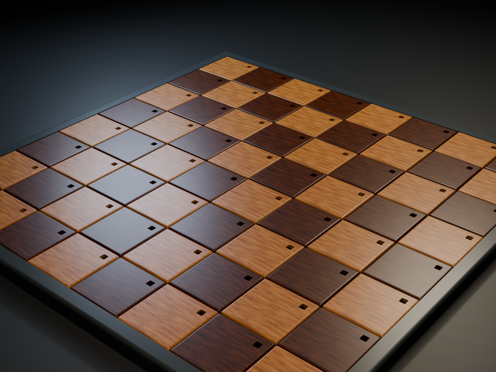
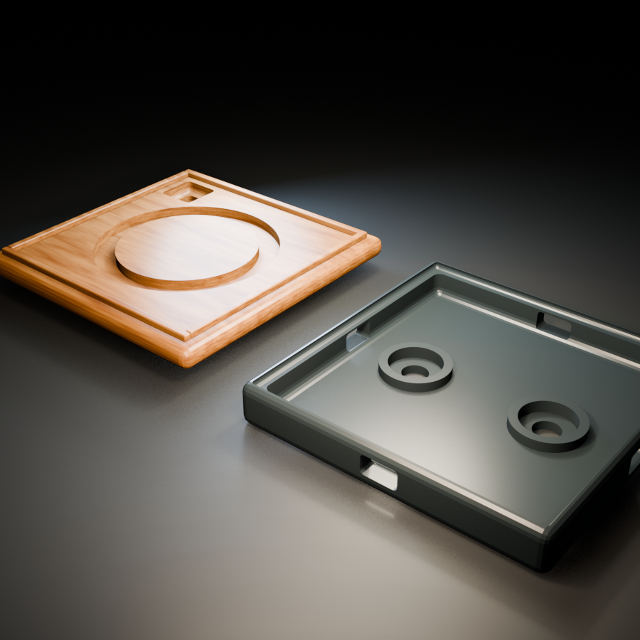

# Chess ♟️

Chess is an open-source smart chessboard you can build, modify, and play on.
Each square senses a magnetic piece and has its own RGB light, allowing the board
to follow a physical game, highlight moves, and provide feedback without needing
a screen or internet connection. A battery-powered Raspberry Pi Pico 2 W runs
the board using Rust firmware.

  
  
   
  The full board—and a peek inside one tiny square. See the <a href="hardware/cad/">Blender CAD sources</a>.

The repository contains the software, electronics, and printable CAD needed to
build the board. The project is still taking shape: the mechanical design and
revision-A electronics are ready for review while the firmware is being built.
Run `make gen` to regenerate the CAD and electronics outputs, or see
[`docs/development.md`](docs/development.md) for the complete development
workflow.
