# Chess crate design

The crate root **is** the package. Firmware, the simulator, persistence,
transport, and tests import types from `chess`. They never import `model/` or
`game/`.

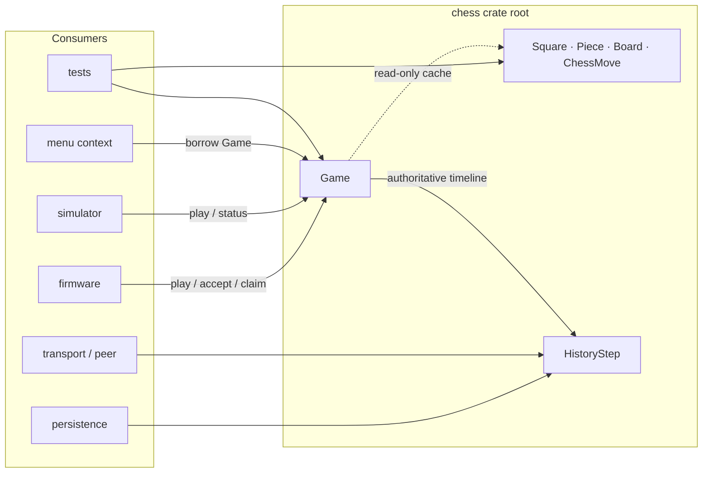

## Package shape

One namespace. No public modules. No crate features. No `unsafe`. `no_std`.

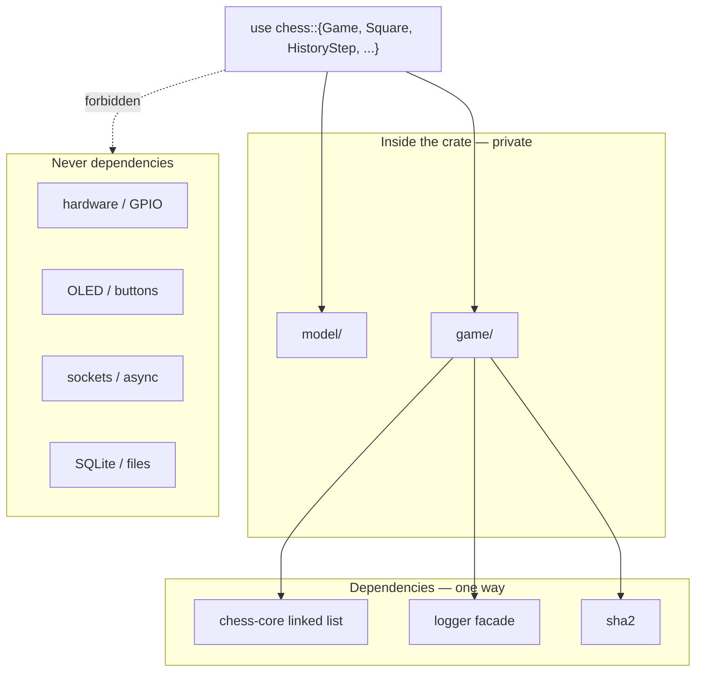

Board geometry, pieces, and legal-move generation allocate nothing.
`GameHistory` is the only allocation boundary.

```text
allocation-free ──────────────────────────── allocate
Square  Piece  Board  ChessMove  SquareSet   GameHistory
                                             (linked list of HistoryStep)
```

## Hold this

Two kinds of values. They are not interchangeable.

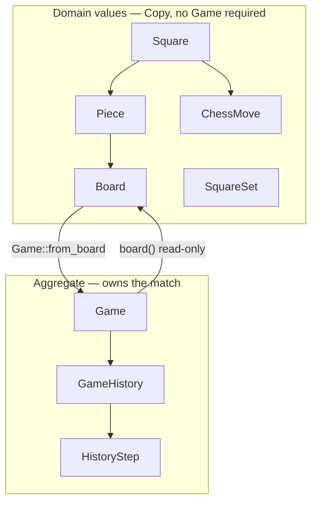

| You are doing | You hold |
|---|---|
| Mapping a Hall sensor, lighting a square, rendering a piece | `Square`, `Piece`, `Board` |
| Playing, claiming, resolving, synchronizing a match | `Game` |
| Writing to a store or a peer | `HistoryStep` |

`Game` never yields `&mut Board`. Setup and physical-board edits that bypass
rules happen on a `Board` **before** `Game::from_board`.

```text
                    Game
        ┌─────────────┼─────────────┐
        │             │             │
   initial_board   board()      history()
   (anchor)        cache        source of truth
        │             │             │
        └──── replay move events ───┘
                    │
                 verify()
```

## Grammar

Methods live on the noun the caller already has.

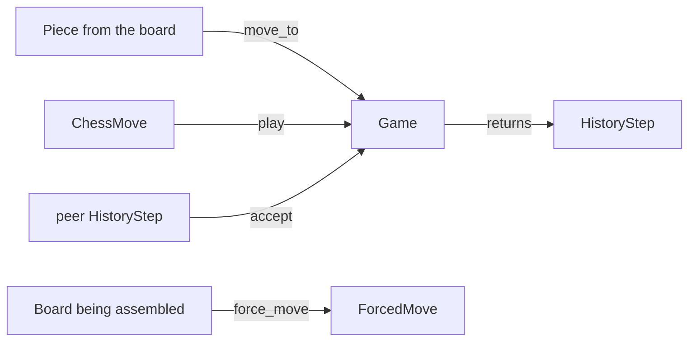

| Caller has | Caller wants | Call |
|---|---|---|
| `Game` | play a coordinate move | `game.play(chess_move)` |
| `ChessMove` | play it | `chess_move.play(&mut game)` |
| `Piece` | move that piece | `piece.move_to(to, &mut game)` |
| promoting pawn | choose the kind | `piece.move_and_promote(to, kind, &mut game)` |
| `Game` | legal squares / status | `game.legal_moves()` / `game.status()` |
| peer `HistoryStep` | apply it | `game.accept(step)` |
| `Board` | relocate without rules | `board.force_move(from, to)` |

`ChessMove` is intent. Construction does not consult a board. `"e2e4"` and
`"e7e8q"` parse with `FromStr`. SAN, PGN, and FEN stay in the application.

`Piece` is self-locating:

```text
┌─────────┬──────────┬─────────┐
│  color  │   kind   │ square  │
│  White  │   Pawn   │   e2    │
└─────────┴──────────┴─────────┘
        move_to(e4)
                │
                v
┌─────────┬──────────┬─────────┐
│  color  │   kind   │ square  │
│  White  │   Pawn   │   e4    │
└─────────┴──────────┴─────────┘
```

Reuse the old `Piece` and `move_to` returns `StalePiece`. Firmware reads the
piece from the current board every ply.

## Squares are the hardware map

Index `0 = a1` through `63 = h8`. File-major, then rank-major.
`Square::E2` and `"e2".parse()` are the same value.

```text
8  a8  b8  c8  d8  e8  f8  g8  h8     56 57 58 59 60 61 62 63
7  a7  b7  c7  d7  e7  f7  g7  h7     48 49 50 51 52 53 54 55
6  a6  b6  c6  d6  e6  f6  g6  h6     40 41 42 43 44 45 46 47
5  a5  b5  c5  d5  e5  f5  g5  h5     32 33 34 35 36 37 38 39
4  a4  b4  c4  d4  e4  f4  g4  h4     24 25 26 27 28 29 30 31
3  a3  b3  c3  d3  e3  f3  g3  h3     16 17 18 19 20 21 22 23
2  a2  b2  c2  d2  e2  f2  g2  h2      8  9 10 11 12 13 14 15
1  a1  b1  c1  d1  e1  f1  g1  h1      0  1  2  3  4  5  6  7
    a   b   c   d   e   f   g   h
```

A Hall sensor at PCB index `12` is `Square::E2`. Do not invent a second
numbering scheme.

## Local play

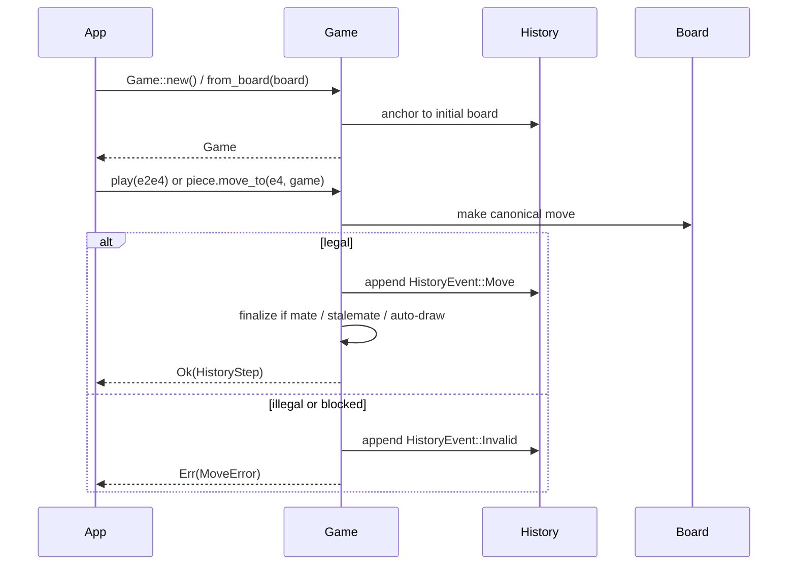

```rust
use chess::{ChessMove, Game, HistoryEvent, Square};

let mut game = Game::new();
let step = game.play(ChessMove::new(Square::E2, Square::E4))?;
assert!(matches!(step.event(), HistoryEvent::Move(_)));
# Ok::<(), chess::MoveError>(())
```

`play` returns the `HistoryStep` to persist or send. Queen is the default
promotion; `move_and_promote` selects any other kind.

`Game::legal_moves` is empty while history is invalid or final. Light LEDs from
the `Game`, not from a copied `Board` that cannot see an unresolved error.

## Observation

Read paths borrow. They do not clone the aggregate.

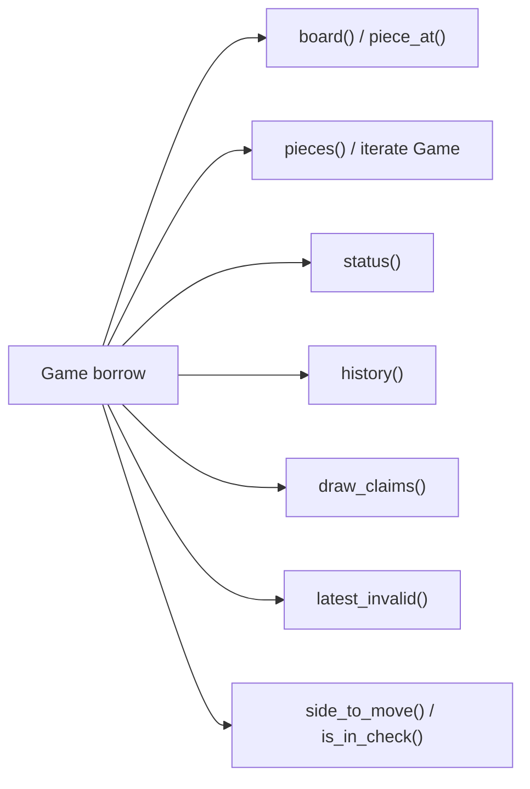

```mermaid
stateDiagram-v2
    [*] --> InProgress: Game::new()
    InProgress --> DrawClaimAvailable: threefold / fifty-move
    DrawClaimAvailable --> InProgress: claim not taken, play continues
    InProgress --> Invalid: rejected play / sync / claim
    DrawClaimAvailable --> Invalid: rejected claim
    Invalid --> InProgress: resolve_latest_invalid
    Invalid --> Invalid: another invalid
    InProgress --> Checkmate: no legal move, in check
    InProgress --> Stalemate: no legal move, not in check
    InProgress --> Draw: auto-draw or claim
    DrawClaimAvailable --> Draw: claim_draw
    Checkmate --> [*]
    Stalemate --> [*]
    Draw --> [*]
```

`status().is_terminal()` is the UI flag for “accept no further legal play.”
Menu code borrows `&Game` while firmware keeps mutable hardware state
elsewhere.

## Invalid operations

Rejected play is retained. The board cache does not change.

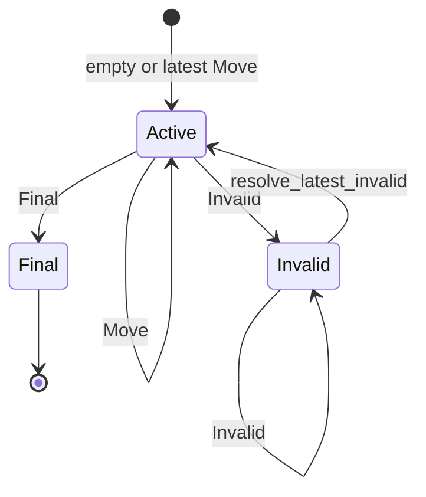

Resolution is a stack. Newest invalid comes off first. A valid move cannot be
spliced underneath.

```text
tip ──► Invalid  PendingInvalid     ◄── resolve_latest_invalid
        Invalid  WrongSide          ◄── then this
        Move     e2e4
        ────────────────────────
        Final seals the timeline. Nothing follows.
```

| Latest event | `play` | `accept` Move/Final | `resolve_latest_invalid` |
|---|---|---|---|
| none / Move | apply or record Invalid | allowed if legal | error |
| Invalid | record `PendingInvalid` | Move/Final refused | pops newest |
| Final | `GameOver` | refused | error |

## Draws

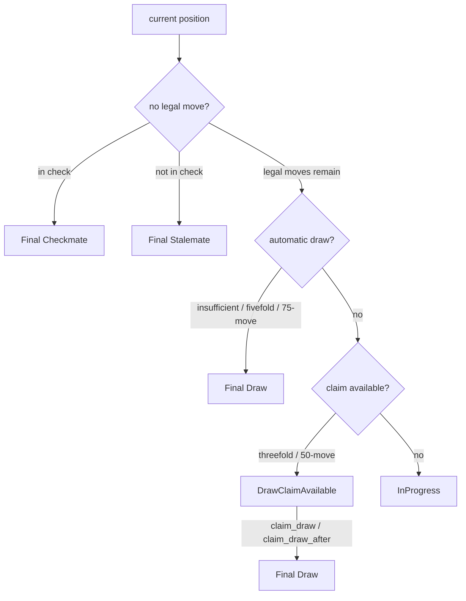

| Situation | Consumer action |
|---|---|
| Threefold or fifty-move | `draw_claims()` then `claim_draw` |
| Claim after an announced legal move | `draw_claims_after(m)` then `claim_draw_after(m, claim)` |
| Fivefold, seventy-five-move, insufficient material | none — already finalized |
| Checkmate or stalemate | none — those outrank remaining claims |

`claim_draw_after` keeps the announced move as evidence and **does not play
it**. The game ends immediately.

Repetition identity:

```text
┌───────────┬──────────────┬──────────┬─────────────────────────┐
│ placement │ side to move │ castling │ en passant if capture   │
│           │              │ rights   │ is actually legal       │
└───────────┴──────────────┴──────────┴─────────────────────────┘
 halfmove / fullmove clocks are not in this key
```

## Synchronization and persistence

The value that leaves the process is `HistoryStep`. It is `Copy`.

```text
┌──────┬──────────────────────┬──────────────┬──────────────┐
│ ply  │ event                │ previous     │ hash         │
│  1   │ Move e2e4            │ board anchor │ SHA-256      │
│  2   │ Move e7e5            │ hash 1       │ SHA-256      │
│  3   │ Invalid WrongSide    │ hash 2       │ SHA-256      │
│  4   │ Final Checkmate      │ hash 3       │ SHA-256      │
└──────┴──────────────────────┴──────────────┴──────────────┘
 anchor ──► step ──► step ──► step ──► tip
```

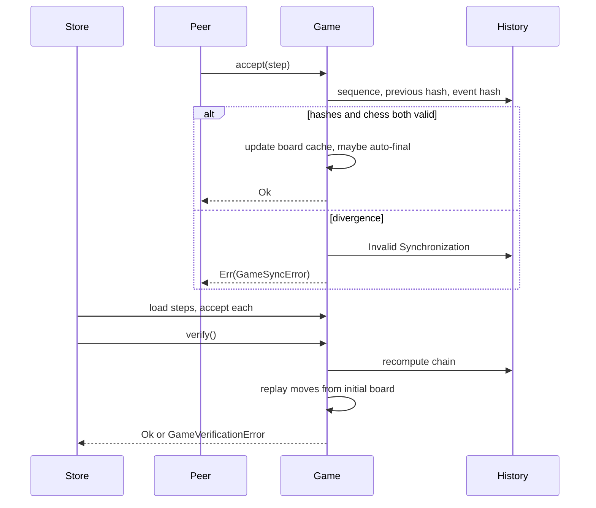

| API | Checks hashes | Checks chess | Updates `Game` board |
|---|---|---|---|
| `Game::accept` | yes | yes | yes |
| `GameHistory::try_append` | yes | **no** | no |
| `Game::play` / `claim_draw` | yes | yes | yes |

Application code playing chess calls `play`, `claim_draw`, `accept`, or
`resolve_latest_invalid`. Do not assemble events by hand and
`try_append` them onto a live game.

The hash chain detects corruption and divergence. It does not authenticate a
peer.

## Setup and the physical board

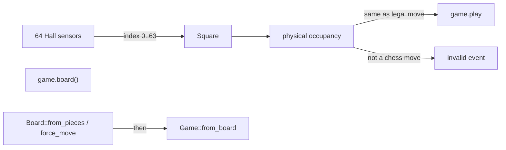

```rust
use chess::{Board, Color, Game, Piece, PieceKind, Square};

let mut board = Board::from_pieces([
    Piece::new(Color::White, PieceKind::King, Square::E1),
    Piece::new(Color::Black, PieceKind::King, Square::E8),
]);
board.set_side_to_move(Color::White);
let game = Game::from_board(board);
```

`Board::force_move` relocates without rules, clocks, castling, en passant, or
history. Compare sensors to `game.board()`, then `play` or record invalid.
It is not a back door into a live `Game`. There is no FEN parser here.

## Logging

Optional sidecar. The API is the `HistoryStep`, not the log line.

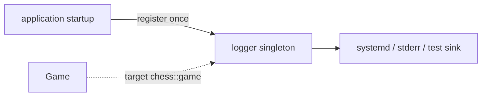

| Event | Level |
|---|---|
| created | debug |
| move, resolution, final | info |
| invalid | warn |

No registration → complete silence. Do not parse log text.

## What stays outside

```text
┌──────────────────────────────────────────────┐
│  chess                                       │
│  rules · values · Game · hash-linked history │
└──────────────────────────────────────────────┘
        ▲
        │  crate root only
┌───────┴──────────────────────────────────────┐
│  firmware   simulator   persistence   net    │
│  GPIO I²C SPI OLED buttons debounce          │
│  SAN PGN FEN UCI  clocks  matchmaking        │
│  files SQLite  auth  search  async           │
└──────────────────────────────────────────────┘
```

`Board::legal_moves` is a rules query, not a search API.

## Hash encodings

Public contract. Private functions. Breaking a tag breaks every stored and
in-flight step.

```text
SHA-256
  domain  chess.game-history.sha256.v1 \0
  previous hash
  ply as big-endian u64
  event tags + payload

SHA-256
  domain  chess.board-anchor.sha256.v1 \0
  64 squares, side, castling, en passant, clocks
```

Do not hash `Debug` output. Equal move lists from different initial boards
must not synchronize: the chain is anchored to the starting position.

## Source layout

Internal map: [`src/README.md`](src/README.md). External rule:

```text
import from chess

  live match     →  Game
  leaves process →  HistoryStep
  describes a position →  Board / Piece / Square
```
